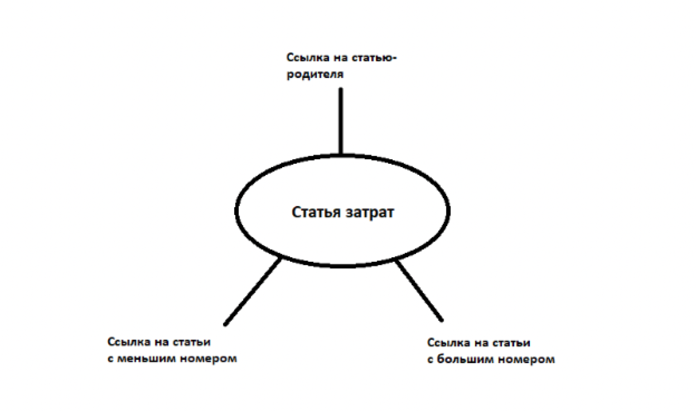

# Техническое задание 

### Проект: Автоматизированный поиск ближайшей статьи затрат с бо́льшим номером.

## Содержание

1. [Раздел I](#chapter-i) \
    1.1. [Введение](#introduction)
    1.2. [Цель проекта](#Objective of the project)
2. [Раздел II](#chapter-ii) \
    2.1. [Функциональные требования](#information)
    2.2. [Структура данных](#Product features)     
    2.3. [Структура, представляющая статью затрат](#information)   
    2.4. [Пример реализации статью затрат на языке С](#information) 
3. [Раздел III](#chapter-iii) \
    3.1. [Алгоритм работы программы](#Product features) 
    3.2. [Алгоритм поиска ближайшей статьи затрат](#Product features) 


## Раздел I

### Введение

Отдел бухгалтерского и налогового учета разрабатывает новый блок отчетов, и для его реализации необходимо разработать программу, которая автоматизирует поиск ближайшей статьи затрат с бо́льшим номером. Статьи затрат пронумерованы и организованы в иерархическую структуру.

### Цель проекта

Разработать программу, осуществляющую поиск ближайшей к заданной статье затрат статью с бо́льшим номером.
Выбор языка программирования для реализации проекта остается за разработчиком.

## Раздел II

### Функциональные требования

- Поиск заданной пользователем статьи затрат 
- Вывод результата поиска статьи затрат
- Поиск ближайшей, к заданной статье затрат статьи с бо́льшим номером.
- Вывод результата поиска ближайшей большей

### Структура данных 

Статьи затрат организованы в иерархическую структуру, где каждая статья имеет ссылку на статью-родителя и две ссылки на статьи-потомки.

### Структура, представляющая статью затрат



У каждой из статей затрат есть: 
	•	ее номер
	•	ссылка на статью-родителя
	•	две ссылки на статьи-потомки. При этом в левой ссылке находятся статьи с меньшим номером, а в правом - с большим.

### Пример реализации статью затрат на языке С

``` brew
struct Article {
    int number;
    Article* parent;
    Article* left_child;
    Article* right_child;
    }
```

## Раздел III

### Алгоритм работы программы

1. Ввод пользователем статьи затрат
2. Поиск введенной статьи затрат
3. Если введенная статья существует, поиск ближайшей к ней статьи с бо́льшим номером.
4. Вывод результата поиска ближайшей бо́льшей статьи.


### Алгоритм поиска ближайшей статьи затрат

1. Ввод номера статьи 
2. Если у статьи есть ссылка на статью-потомка с бо́льшим номером, то в результат записываем номер 
статью-потомка, завершаем поиск
3. Если у статьи нет ссылки на статью-потомка с бо́льшим номером, то переходим к родительской статье
и выполняем последовательно шаги 2. и 3.
4. Вывод результата


